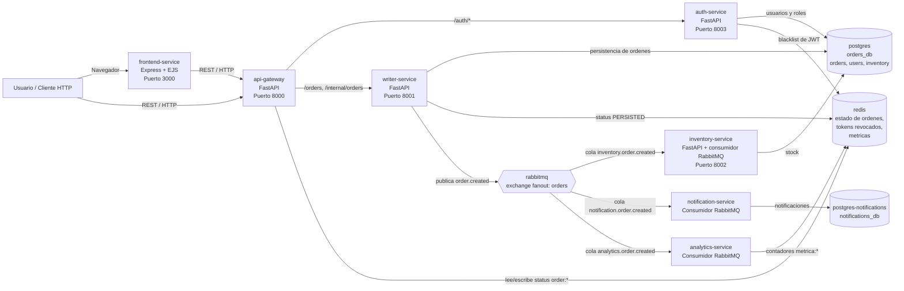
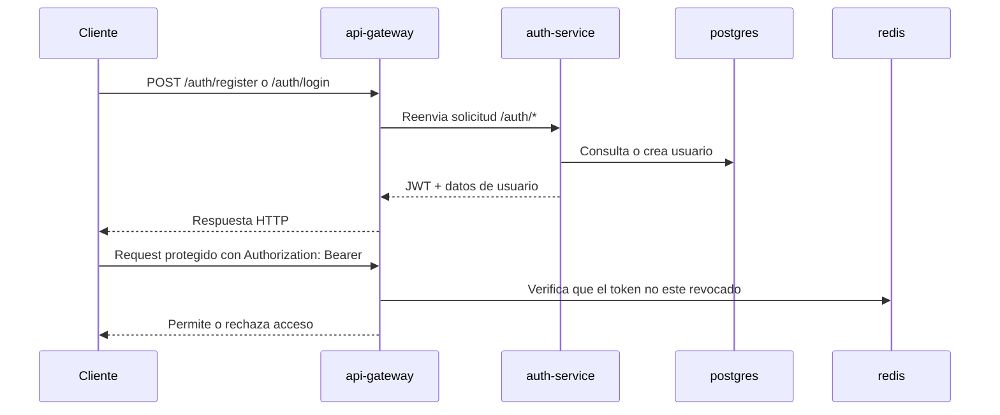
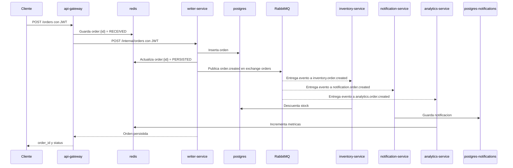

# Sistema distribuido de ordenes

Arquitectura de microservicios para registro/autenticacion de usuarios, recepcion de ordenes, persistencia, reserva de inventario, notificaciones y metricas. El sistema esta orquestado con Docker Compose y combina comunicacion HTTP sincrona con mensajeria asincrona por RabbitMQ.

## Diagrama de arquitectura



> Nota: `frontend-service` existe en el repositorio como aplicacion Express, pero no esta incluido en el `docker-compose.yml` principal. Puede ejecutarse aparte o agregarse al Compose si se desea desplegar la interfaz junto con los microservicios.

## Componentes principales

| Componente | Tecnologia | Responsabilidad |
| --- | --- | --- |
| `api-gateway` | FastAPI | Punto de entrada HTTP. Expone autenticacion y ordenes, valida JWT, consulta Redis para estado y reenvia solicitudes al `auth-service` y `writer-service`. |
| `auth-service` | FastAPI + SQLAlchemy | Registra usuarios, valida credenciales, emite JWT, consulta usuario actual y revoca tokens usando Redis. |
| `writer-service` | FastAPI + SQLAlchemy | Persiste ordenes, asocia la orden al usuario autenticado, actualiza estado en Redis y publica eventos `order.created`. |
| `inventory-service` | FastAPI + consumidor RabbitMQ | Permite cargar/consultar inventario por HTTP y descuenta stock al consumir eventos de orden creada. |
| `notification-service` | Consumidor RabbitMQ + SQLAlchemy | Escucha eventos de orden creada y guarda notificaciones en una base PostgreSQL separada. |
| `analytics-service` | Consumidor RabbitMQ + Redis | Escucha eventos de orden creada y actualiza metricas simples en Redis. |
| `frontend-service` | Express + EJS | Interfaz web para login, registro, dashboard y creacion de ordenes. |

## Infraestructura

| Servicio | Puerto local | Uso |
| --- | --- | --- |
| `postgres` | `5432` | Base principal para ordenes, usuarios e inventario. |
| `postgres-notifications` | `5433` | Base aislada para notificaciones. |
| `redis` | `6379` | Estado rapido de ordenes, blacklist de JWT y metricas de analitica. |
| `rabbitmq` | `5672` | Broker AMQP para eventos de ordenes. |
| `rabbitmq-management` | `15672` | Consola de administracion de RabbitMQ en desarrollo. |

## Flujo de autenticacion



## Flujo de creacion de orden



## Mensajeria

El `writer-service` publica eventos `order.created` en el exchange `orders`, declarado como `fanout`. Cada consumidor tiene su propia cola durable, por lo que todos reciben una copia del evento:

- `inventory.order.created`: descuenta stock de los productos de la orden.
- `notification.order.created`: guarda una notificacion de confirmacion.
- `analytics.order.created`: incrementa contadores como `metrica:ordenes_creadas` y `metrica:productos_pedidos`.

Este desacoplamiento permite que la escritura de la orden responda por HTTP mientras los procesos derivados ocurren de forma asincrona.

## Seguridad

- Las rutas publicas son `GET /health`, `POST /auth/register` y `POST /auth/login`.
- Las rutas de negocio requieren `Authorization: Bearer <token>`.
- El JWT incluye `sub`, `email`, `role` y `exp`.
- `api-gateway`, `writer-service` e `inventory-service` validan el token localmente.
- `auth-service` revoca tokens guardando una entrada temporal en Redis hasta su expiracion.
- `writer-service` filtra ordenes por usuario, salvo usuarios con rol `admin`.

## Despliegue local

```bash
docker compose up --build
```

Endpoints principales:

- API Gateway: `http://localhost:8000`
- Writer Service: `http://localhost:8001`
- Inventory Service: `http://localhost:8002`
- Auth Service: `http://localhost:8003`
- RabbitMQ Management: `http://localhost:15672`

Health checks utiles:

```bash
curl http://localhost:8000/health
curl http://localhost:8001/health
curl http://localhost:8002/health
curl http://localhost:8003/health
```

## Variables de entorno relevantes

| Variable | Uso |
| --- | --- |
| `JWT_SECRET` | Llave para firmar y validar JWT. |
| `JWT_ALGORITHM` | Algoritmo JWT, por defecto `HS256`. |
| `JWT_EXPIRE_MINUTES` | Tiempo de vida del token. |
| `DATABASE_URL` | Conexion a PostgreSQL principal. |
| `NOTIFICATIONS_DATABASE_URL` | Conexion a PostgreSQL de notificaciones. |
| `REDIS_URL` | Conexion a Redis. |
| `RABBITMQ_URL` | Conexion AMQP a RabbitMQ. |
| `ORDERS_EXCHANGE` | Exchange de eventos de ordenes, por defecto `orders`. |
| `AUTH_SERVICE_URL` | URL interna del servicio de autenticacion. |
| `WRITER_SERVICE_URL` | URL interna del servicio de escritura de ordenes. |
